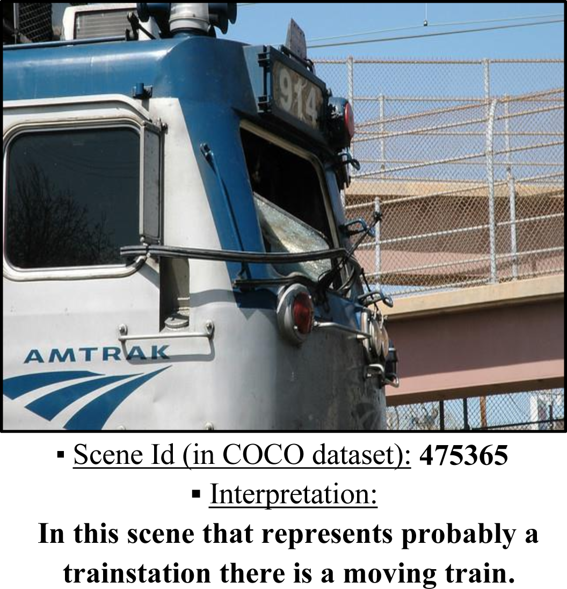
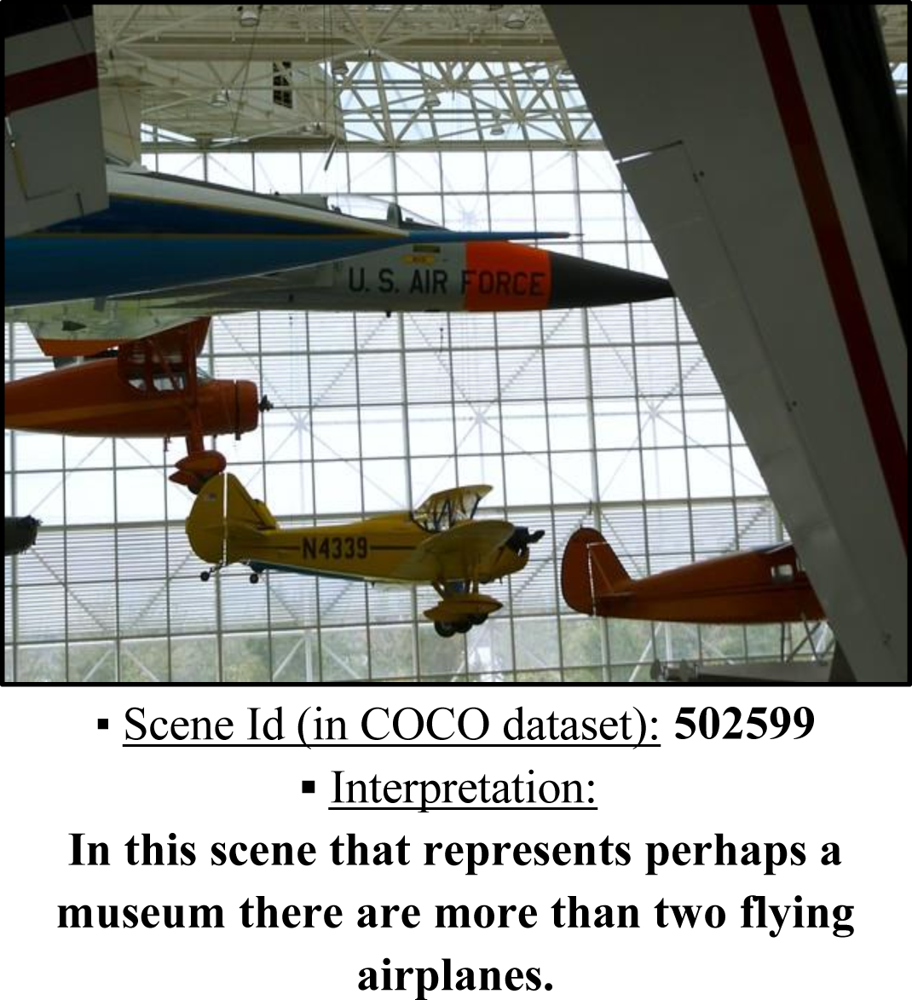
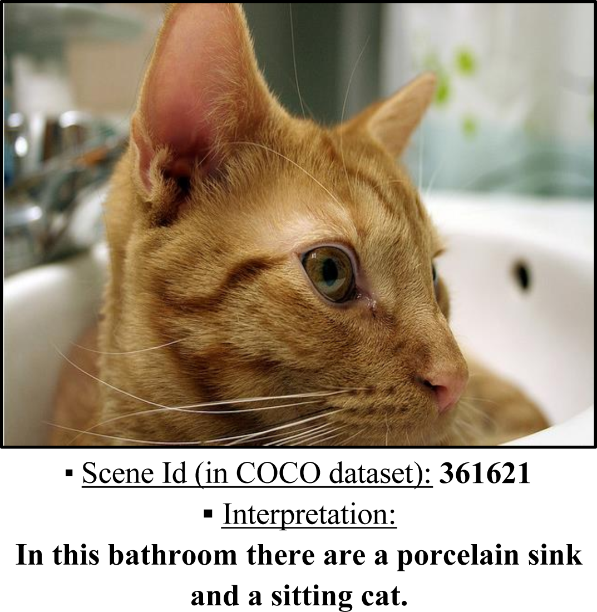
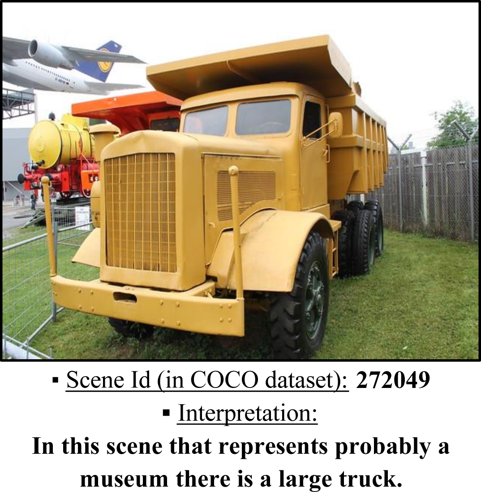
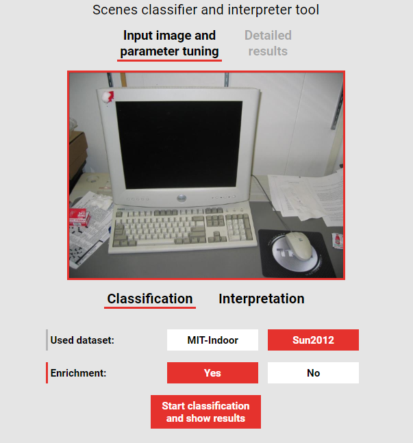
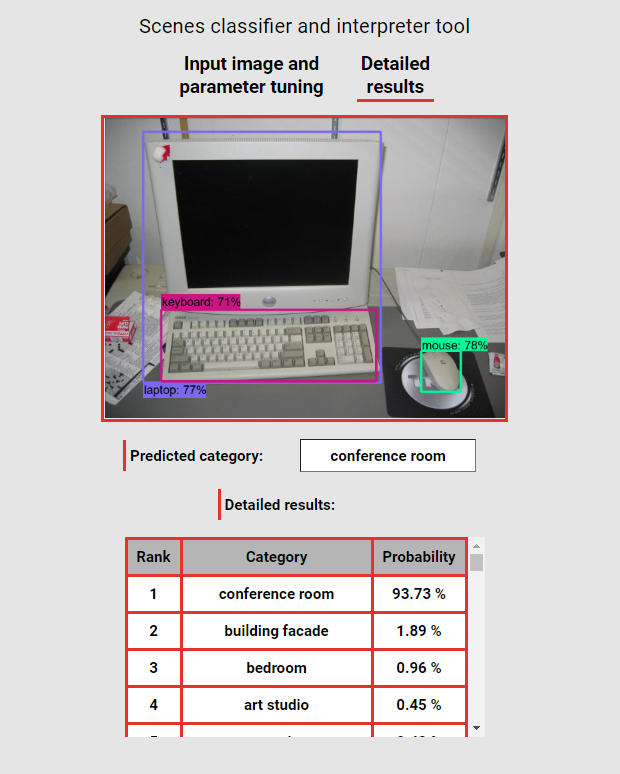
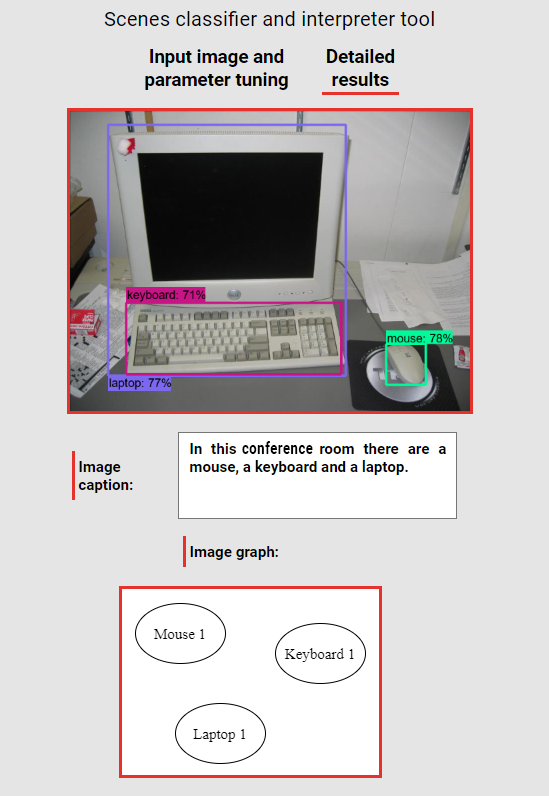

# Scenes Interpreter Tool

> An application to generate textual description (in English) which forms an image interpretation, based on its objects. This is done by a succession of multiple steps, based on machine learning models trained on various datasets: Classification (with a novel method: Scenes enrichment), visual relationships identification and definition, and description generation with Natual Language Processing.

## General Info

**Master's degree graduation project** in *artificial intelligence*, realized from **February to September 2020**. The goal was to initiate in scientific research by proposing an approach to interpret scenes by exploiting their high features: Objects contained in the scenes. For that, various approaches were exploited to realize this task. Definitive proposed approach consists of three major steps: Scene classification (to standard class, with a novel method: Scenes enrichment, and classification to additional categories), identification and definition of visual relationships (the most important ones, between the scene objects) and the description generation (with a relationships graph and NLP).

## Examples

### Scene interpretations

Some correct scene interpretations by the proposed approach. For more examples, see ``Appendix B (page 122)`` in the Master's thesis.

<p align="center">
  
  
  
  
</p>

### Application

Screenshots of the developed application. A [video (with comments in French) is also available on YouTube](https://youtu.be/0IVYHbdX-QA). For more details, see ``Chapter 3 (from page 92)`` in the Master's thesis.

<p align="center">
  
  
  
</p>

## Project content

```text
.
├── examples                                                  <- Contains GUI's screenshots and some obtained results
│
├── master's thesis                                           <- Contains Master's thesis in PDF format
│
├── src                                                       <- Contains the application source-code
│   ├── pfe_app                                               <- Contains the application's back-end part (with Django)
│   │   ├── pfe_app                                           <- Contains configuration files of the Django server
│   │   ├── scenes_tool                                       <- Contains the application's principal service
│   │   │   ├── functions                                     <- Contains the necessary functions for the service's execution
│   │   │   │   ├── scenes_tool_data                          <- Contains the data used by the functions (trained models and JSON files)
│   │   │   │   │   ├── additional_categories                 <- Contains subcategories classification data
│   │   │   │   │   ├── object_detection                      <- Contains object detection data in images
│   │   │   │   │   ├── rels_definers                         <- Contains visual relationships definition data
│   │   │   │   │   │   ├── binary_rels                       <- Contains the trained definer of binary relations
│   │   │   │   │   │   └── unary_rels                        <- Contains the trained definers of unary relations
│   │   │   │   │   ├── rels_identifier                       <- Contains visual relationships identification data
│   │   │   │   │   └── standard_classifiers                  <- Contains scenes standard classification data
│   │   │   │   ├── additional_categories_classification.py   <- Assign the most probable subcategories to a scene
│   │   │   │   ├── bounding_box_class.py                     <- Define bounding-boxes manipulation class
│   │   │   │   ├── config.py                                 <- Structure the files paths used in the functions
│   │   │   │   ├── image_base64_manip.py                     <- Handle images under "base64" encoding
│   │   │   │   ├── object_detection.py                       <- Detect objects contained in an image
│   │   │   │   ├── rels_definition.py                        <- Define the unary/binary identified visual relationships
│   │   │   │   ├── rels_identification.py                    <- Reveal important visual relationships between objects
│   │   │   │   ├── scene_graph_generation.py                 <- Build and draw the "scene graph"
│   │   │   │   ├── scenes_description_generation.py          <- Generate a text description for a scene
│   │   │   │   ├── scenes_enrichment.py                      <- Enrich a scene with new objects
│   │   │   │   └── standard_classification.py                <- Assign the most probable category to a scene
│   │   │   ├── views.py                                      <- Communication point between the front-end and the back-end
│   │   │   └── ...                                           <- Other files/folder generated by Django
│   │   └── ...                                               <- Other files generated by Django
│   ├── website_data                                          <- Contains the application's front-end part (HTML, CSS and JS)
│   └── index.html                                            <- Application entry point
│
├── LICENSE.md                                                <- Current project license
├── README.md                                                 <- Current project info
│
└── requirements.txt                                          <- Libraries required by Python
```

Note that the [Master's thesis](https://github.com/seloufian/Scenes-Interpreter-Tool/blob/master/master%27s+thesis/Classification+and+interpretation+of+object-based+scenes.pdf) is in French.

## Technologies

### Back end

- Using Python, with libraries/frameworks: [NumPy](https://numpy.org/), [TensorFlow](https://www.tensorflow.org/), [Keras](https://keras.io/), [Pillow](https://python-pillow.org/), [Matplotlib](https://matplotlib.org/), [networkX](https://networkx.org/), [Inflect](https://pypi.org/project/inflect/), [Django](https://www.djangoproject.com/).
- Note that other libraries (not included in the project files) were also used: [BeautifulSoup4](https://www.crummy.com/software/BeautifulSoup/), [Requests](https://requests.readthedocs.io/en/master/), [NLTK](http://nltk.org/).
- Used datasets: [MIT-Indoor](http://web.mit.edu/torralba/www/indoor.html), [SUN2012](https://groups.csail.mit.edu/vision/SUN/hierarchy.html), [VisualGenome](https://visualgenome.org/), [COCO](https://cocodataset.org/).
- The development was done in [Google Colab](https://colab.research.google.com/).

### Front end

- Used technologies: HTML, CSS, JavaScript.

## How it works

To understand how the proposed approach works, see ``Chapter 2 (page 31)`` in the Master's thesis.

## Complementary Google Drive

Considering the voluminous size of the project (8.5 GB), caused principally by the trained models, it is divided into two complementary parts:

- Current GitHub repository (48 MB).
- A [Google Drive (8.4 GB)](https://drive.google.com/drive/folders/1-AbSMfdHt0q3bpzASo5uEVIY2QH7B9yn), which has the following structure:

```text
.
├── master's thesis                                       <- Contains Master's thesis related files
│   ├── figures                                           <- Contains all the figures used in the master's thesis
│   ├── Classification and interpretation of [...].docx   <- The Master's thesis in Microsoft Word format
│   ├── Classification and interpretation of [...].pdf    <- The Master's thesis in PDF format
│   ├── Slides - Presentation.pdf                         <- Presentation slides in PDF format
│   └── Slides - Presentation.pptx                        <- Presentation slides in Microsoft PowerPoint format
│
├── application_data                                      <- Necessary data to execute the developed application (trained models)
│   ├── unary_classifier_models
│   ├── object_detection_model
│   ├── enrichment_model
│   └── standard_classifier_models
│
└── drive_info.txt                                        <- Current Google Drive description
```

## Application use

To run it, the application requires complementary files located in [the Drive](https://drive.google.com/drive/folders/1-AbSMfdHt0q3bpzASo5uEVIY2QH7B9yn). So, once the repository is cloned, add to it missing files (with respecting paths: "Copy from" and "Copy to") according to the following table (for each cell, concatenate the header's current column path with the path in the cell itself):

| Google Drive - Copy from: "./application_data/"              | GitHub Repository - Copy to: "./src/pfe_app/scenes_tool/"      |
| ------------------------------------------------------------ | -------------------------------------------------------------- |
| unary_classifier_models/*.h5                                 | functions/scenes_tool_data/rels_definers/unary_rels/           |
| object_detection_model/saved_model.pb                        | functions/scenes_tool_data/object_detection/saved_model/       |
| object_detection_model/object_detection/   (whole directory) | functions/scenes_tool_data/object_detection/tf_model/          |
| enrichment_model/mitindoor_enrichment_model.h5               | functions/scenes_tool_data/additional_categories/              |
| standard_classifier_models/mitindoor_new_enrichment_model.h5 | functions/scenes_tool_data/standard_classifiers/mitindoor_new/ |

Note that the application can be executed with some/without unary relationship definers (models in ``./application_data/unary_classifier_models/``).
After that, make sure you have all [``requirements``](https://github.com/seloufian/Scenes-Interpreter-Tool/blob/master/requirements.txt). And finally, run the Django server and execute the application via ``./src/index.html``.

Some remarks related to the application execution:

- The object detection model ``./src/pfe_app/scenes_tool/functions/scenes_tool_data/object_detection/tf_model/object_detection/`` (from [TensorFlow Model Zoo: Object detection](https://github.com/tensorflow/models/tree/master/research/object_detection)) was compiled in Windows 10. So, a recompilation may be necessary for other OS.
- The Django server's URL (for sending/receiving data between the backend and frontend) is ``127.0.0.1:8000``. To change it, go to ``./src/website_data/output_data.js`` (first line).
- To make development easy, requests to Django's server ([CORS](https://developer.mozilla.org/fr/docs/Web/HTTP/CORS)) were allowed from all sources, this can cause an important security threat. To modify this behavior, go to ``./src/pfe_app/pfe_app/settings.py``.

## Credits and License

This project was realized in [Laboratory of Research in Artificial Intelligence (LRIA)](https://lria.usthb.dz/), group [BioInformatics and Robotics (BIR)](https://lria.usthb.dz/equipes-de-recherche/bir), affiliated to the [University of Science and Technology Houari Boumediene (USTHB)](https://en.wikipedia.org/wiki/University_of_Science_and_Technology_Houari_Boumediene), by:

- [Me] Soufian Przemysław BENAMARA ([LinkedIn](https://www.linkedin.com/in/seloufian/) - [Email](mailto:seloufian@gmail.com)).
- Mohamed Elamine DERARDJA ([LinkedIn](https://www.linkedin.com/in/mohamed-derardja-4061a01b8/) - [Email](mailto:mohamed.ea.der@gmail.com)).

Supervised and proposed by:

- Mrs. N. Baha ([ResearchGate](https://www.researchgate.net/profile/Nadia_Touzene) - [Email](mailto:bahatouzene@gmail.com)).
- Mr. Lamine BENRAIS ([ResearchGate](https://www.researchgate.net/profile/Lamine_Benrais) - [LinkedIn](https://www.linkedin.com/in/lamine-benrais/) - [Email](mailto:benrais.lamine@gmail.com)).

This project is distributed under the ``MIT`` license. For more details, see [``LICENSE.md``](https://github.com/seloufian/Scenes-Interpreter-Tool/blob/master/LICENSE.md).
